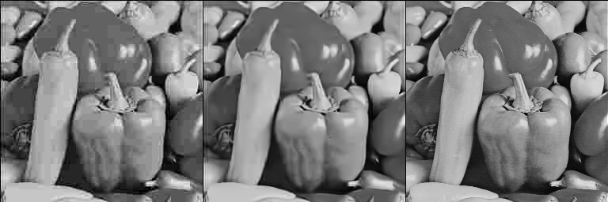
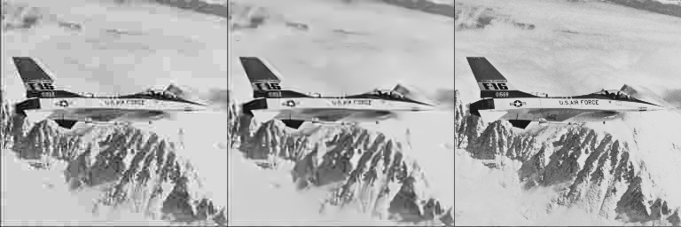
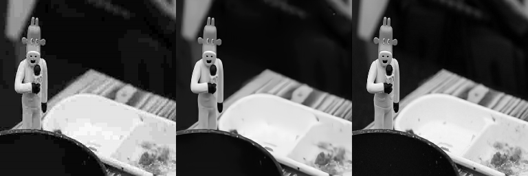
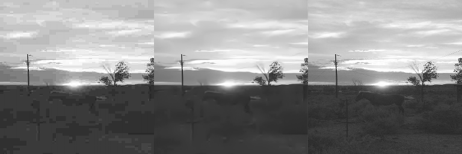

# MemNet. 
* Tensorflow implementation of MemNet in the paper "MemNet: A Persistent Memory Network for Image Restoration" [[Paper]](http://cvlab.cse.msu.edu/pdfs/Image_Restoration%20using_Persistent_Memory_Network.pdf)
* Borrowed code and ideas from tyshiwo's MemNet: https://github.com/tyshiwo/MemNet.

## Install Required Packages
First ensure that you have installed the following required packages:
* TensorFlow1.4.0 ([instructions](https://www.tensorflow.org/install/)). Maybe other version is ok.
* Opencv ([instructions](https://github.com/opencv/opencv)). Here is opencv-2.4.9.

See requirements.txt for details.

## Datasets
* In the implementation of the MemNet, VOC2007 and VOC2012 dataset as the training data, Set12 as the testing data.
* Run the **scripts/generate_voc0712_compress.py** to generate compressed VOC images with quality factor 10. You should change the path of the data. Utilize cv2.imwrite() to change the quality factor, see the **scripts/generate_voc0712_compress.py** for details.
* The Set12 dataset can be downloaded from here [download](https://drive.google.com/open?id=1nCkWFU3ksMB8ggqRHBrSMS2kjN6N6Ayq). Run the **scripts/set12_compress.py** to generate compressed Set12 images with quality factor 10. Also, you should change the path of the data.
* Run the **scripts/build_tfrecords.py** to generate training data, data format is tfrecords. In the process of generating TFRecords file, add two filed in the Features, one is clean images, the other is noisy images. When training MemNet, all the training data are converted to gray-scale images and resized to 256x256.

## Training a Model
* Run the following script to train the model, in the process of training, will save the training images every 500 steps. See the **model/MemNet.py** for details.
```shell
sh train.sh
```
You can change the arguments in train.sh depend on your machine config.
* Run the following script to test the trained model. The test.sh will deblock the Set12 datasets with encoder quality factor 10. 
```shell
sh test.sh
```
The script will load the trained MenNet model to generate the deblocked images. You could change the arguments in test.sh depend on your machine config.
* Run the following script to compute the PSNR/SSIM between the compressed images and the clean images, the deblocked images and the clean images.
```shell
cd scripts
python cal_psnr_ssim.py
```
You could change the arguments in cal_psnr_ssim.py depend on your machine config.

## Downloading data/trained model
* The VOC2007 and  VOC2012 dataset can be downloaded on the internet.
* Pretrained model: [download](https://drive.google.com/open?id=1JTneCiIZfITyg_Z2T96WY0hA84BnRDSk). Training about 74000 steps, the loss has converged, it has alse generate a good result. Although the generated images wiil be blurred.

## More Qualitative results
I only implement the JPEG deblocking experiment, you can implement the image denosing and Super-resolution use this codes. If so, you should change the training datasets. Here is the training loss and JPEG deblocking results. The first column is the compressed image, second is the deblocked image, third is the clean image.
* Testing results.
 

 

* Training results.
 


